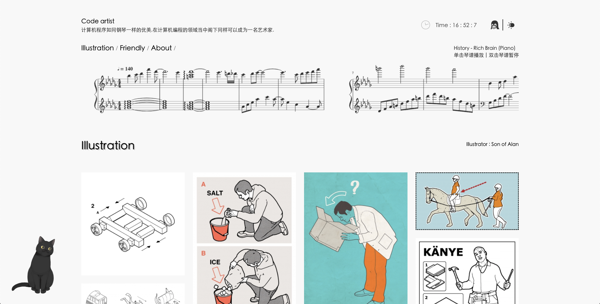

# Training Project 1quarter2021

### 2021第一季度实训项目
 
 
 
## 本设计的背景和意义

在生活中我们接触的网站大多都是娱乐类网购类新闻类等..很少会接触到展览类/艺术类的网站，至此我们选择了展览网站来当作我们的主题。

 程序员在大多数人眼中都是标配双肩电脑包，衣着格子衫。实际并不是这样的，我想表达程序员朴实的外表蕴藏着一颗有艺术色彩的心。

“计算机程序如同钢琴一样的优美,在计算机编程的领域当中阁下同样可以成为一名艺术家。”
 
效果图：

 
本此作品参考自[folioart](https://folioart.co.uk/illustrator/son-of-alan)
并加入了一些个人的想法～